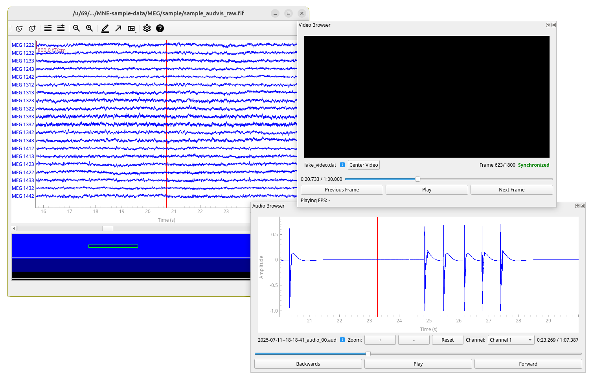

# Video browser extension for MNE Python's qt raw data browser

This is an open-source Python package for browsing video and audio time-synchronized to MEG/EEG data.
It serves as an add-on for [mne-qt-browser](https://github.com/mne-tools/mne-qt-browser), which is part
of [MNE-Python](https://mne.tools/stable/), an open-source Python package for exploring, visualizing,
and analyzing human neurophysiological data.

This project also complements [Helsinki VideoMEG project](https://github.com/Helsinki-VideoMEG-Project)
by supporting video and audio files recorded with their software.


Screenshot of the browser extension showing video from our validation measurement (in which a plushie named Herba kindly
volunteered to be the test subject), synchronized with MNE-Python's sample MEG data.

## Installation

In addition to MNE-Python, this project requires package `OpenCV` for standard video file (such as .mp4) reading
and `sounddevice` for audio playback. For the qt backend to work correctly, MNE-Python should be installed using
[conda](https://github.com/conda/conda?tab=readme-ov-file).

1. Create a new conda environment (named `mne-videobrowser`) with MNE-Python installed.

   ```bash
   conda create --channel=conda-forge --strict-channel-priority --name=mne-videobrowser mne
   ```

2. Activate the environment:

   ```bash
   conda activate mne-videobrowser
   ```

3. Install this package with rest of the dependencies:

   ```bash
   pip install mne-videobrowser
   ```

4. Only on linux: If you do not have [PortAudio library](https://www.portaudio.com/), which is
dependecy of `sounddevice` installed, install it. For example on Ubuntu/Debian:

   ```bash
   sudo apt install libportaudio2
   ```

Now you should be able to test the video browser by running example scripts in `scripts/` directory. For example:

```bash
python scripts/run_video_sync_demo_2.py
```

Script `run_video_sync_demo_2.py` uses a sample dataset from MNE Python and a fake video file. Other examples require you
to have your own raw data and video files in a correct format.

## For developers

### Installation for development

To install this package for development, follow steps 1 and 2 in regular installation guide
(and maybe rename the conda environment to `mne-videobrowser-dev` or similar to distinguish it from the
stable version) and then

1. Clone this repository and navigate to project root.

2. Install the package in editable mode.

   ```bash
   pip install -e .
   ```

   Editable mode ensures that changes in source code are reflected to the installed package.

### Running tests

Tests are located in directory `tests/` and they run using package `pytest`. You can install it to your environment by running:

```bash
pip install -e .[dev]
```

Then you can run all the tests with:

```bash
pytest
```

You can also selectively run tests in a specific file/class/method. See [pytest documentation](https://docs.pytest.org/en/stable/how-to/usage.html) for details.
