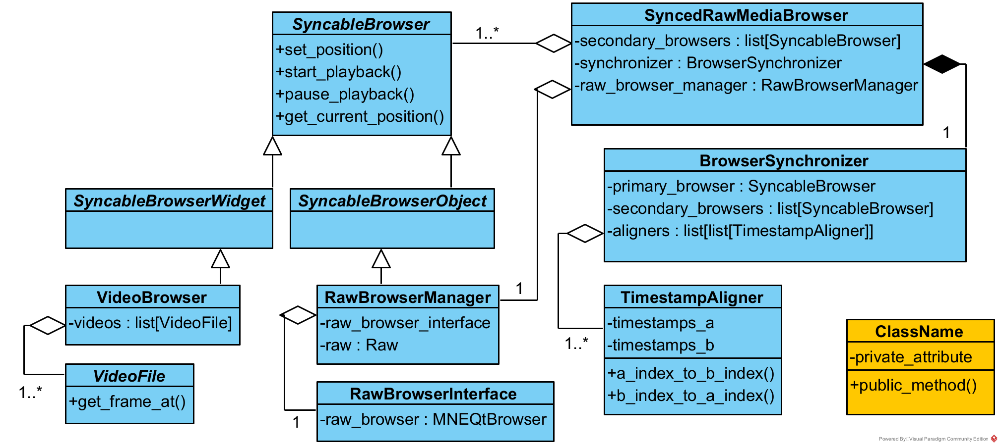

Class Diagram
=============

Here you can find a class diagram representing the main classes and their relationships in the package.
The diagram is not perfectly up-to-date with the codebase, but it still gives an overview of the architecture.
The main functions such as :func:`~mne_videobrowser.browse_raw_with_video` first create a :class:`~mne_videobrowser.browsers.SyncableBrowser` instance, and
pass it for the main controller ``SyncedRawMediaBrowser``, which handles setting up the GUI and synchronization
updates between the media browser(s) and MNE-Python's raw data browser.

